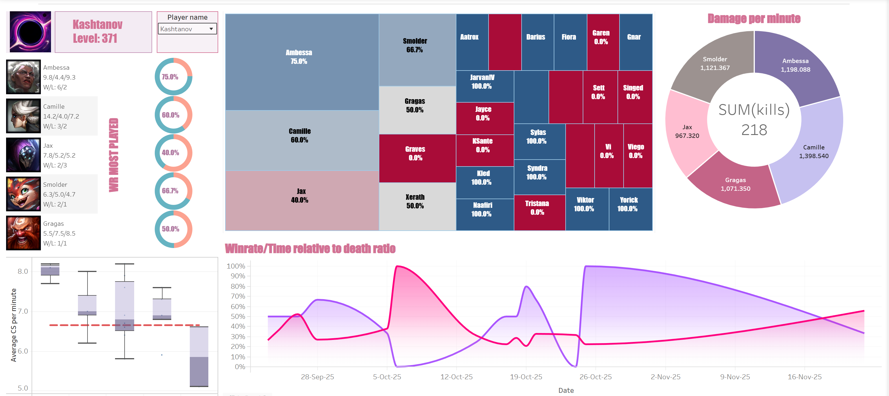
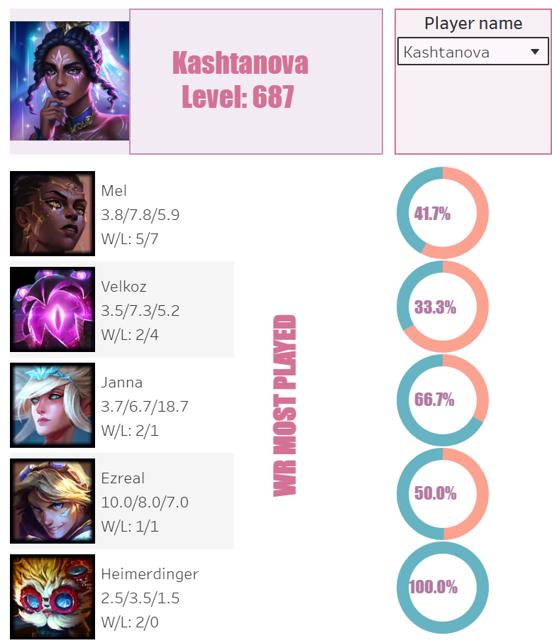
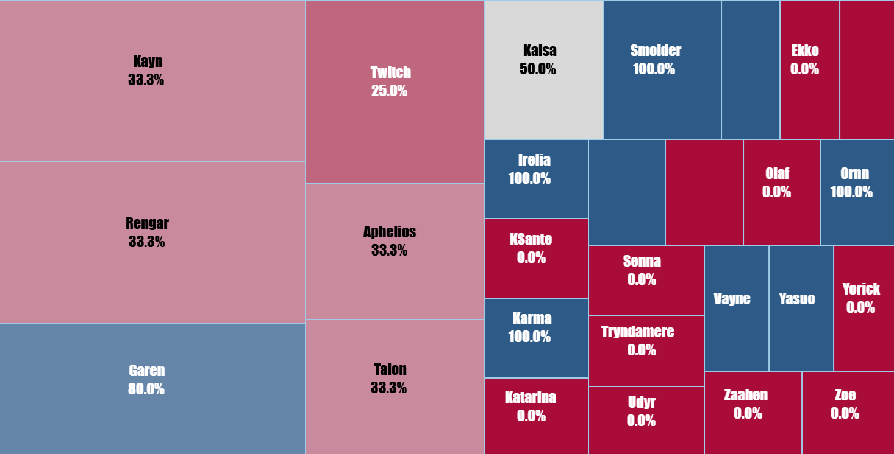

# League of Legends Player Analytics Dashboard

> End-to-end data pipeline for extracting, analyzing, and visualizing League of Legends player performance metrics

[](https://www.python.org/downloads/)
[](https://public.tableau.com/)

##  Live Dashboard

**[→ View Interactive Tableau Dashboard](https://public.tableau.com/shared/ZFJX7SQ4S?:display_count=n&:origin=viz_share_link)**

##  Project Overview

This project implements a complete data analytics pipeline that:
1. **Extracts** player match data from the Riot Games API
2. **Stores** data in a SQLite database with optimized schema
3. **Analyzes** performance metrics and detects anomalous games
4. **Exports** processed data to CSV for visualization
5. **Visualizes** insights through an interactive Tableau Public dashboard

The dashboard provides comprehensive champion performance analysis including:
- Top 5 most-played champions with KDA breakdowns
- Win rate analysis with visual donut charts
- Champion pool diversity treemap
- Multi-player comparison capabilities
- Anomaly detection for standout performances

##  Key Features

- **Automated Data Extraction**: Fetches match history for multiple players via Riot Games API
- **Multi-Player Tracking**: Monitors performance across 4+ players simultaneously
- **Champion Analytics**: Aggregates statistics per champion (KDA, win rate, GPM, CS/min)
- **Anomaly Detection**: Identifies exceptional performances using statistical thresholds
- **Interactive Visualization**: Tableau dashboard with player filters and drill-down capabilities
- **Scalable Pipeline**: Modular architecture for easy extension and maintenance

##  Tech Stack

| Component | Technology |
|-----------|-----------|
| **Language** | Python 3.12+ |
| **Data Source** | Riot Games API |
| **Database** | SQLite with SQLAlchemy ORM |
| **Data Processing** | Pandas, NumPy |
| **Analysis** | SciPy (statistical analysis) |
| **Visualization** | Tableau Public |
| **Package Manager** | uv |

##  Dashboard Highlights

### Sheet 1: Top 5 Champions Performance
- Champion icons and names
- Individual K/D/A metrics displayed as cards
- Win rate donut charts (wins vs losses)
- Games played count per champion
- Player filter for individual analysis

### Sheet 2: Player Performance Board
- Champion win rate comparison (bar chart)
- KDA breakdown by champion (grouped bars)
- Champion pool diversity (treemap)
- Performance metrics overview

##  Getting Started

### Prerequisites

- Python 3.12 or higher
- Riot Games API key ([Get one here](https://developer.riotgames.com/))
- uv package manager ([Installation guide](https://github.com/astral-sh/uv))

### Installation

1. **Clone the repository**
   ```bash
   git clone https://github.com/Kashtanov0/Lol-dashboard.git
   cd lol-dashboard-v3
   ```

2. **Install dependencies**
   ```bash
   uv sync
   ```

3. **Configure environment variables**
   ```bash
   cp .env.example .env
   ```
   
   Edit `.env` and add your Riot API key:
   ```
   RIOT_API_KEY=your_api_key_here
   ```

4. **Configure players to track**
   
   Edit `config.py` to add players:
   ```python
   PLAYERS = [
       {"name": "PlayerName", "tag": "TAG1"},
       {"name": "AnotherPlayer", "tag": "TAG2"},
   ]
   ```

### Usage

**Run the complete pipeline:**
```bash
uv run python main.py
```

This executes three steps:
1. **Extract**: Fetches match data from Riot API
2. **Analyze**: Calculates statistics and detects anomalies
3. **Export**: Generates CSV files for Tableau

**Output files** (in `tableau_data/`):
- `match_history.csv` - Game-by-game performance data
- `player_summary.csv` - Aggregated player statistics
- `anomalies.csv` - Exceptional game performances
- `player_insights.csv` - Automated performance insights

##  Project Structure

```
lol_dashboard_v3/
├── main.py                 # Pipeline orchestrator
├── config.py               # Configuration (players, regions, settings)
├── api_client.py           # Riot API client with rate limiting
├── database.py             # SQLAlchemy models and database operations
├── extract.py              # Data extraction logic
├── analysis.py             # Statistical analysis and anomaly detection
├── export.py               # CSV export for Tableau
├── models.py               # Data models
├── pyproject.toml          # Project dependencies
├── .env                    # Environment variables (not in repo)
├── .gitignore              # Git ignore rules
├── tableau_data/           # CSV exports for Tableau
│   ├── match_history.csv
│   ├── player_summary.csv
│   ├── anomalies.csv
│   └── player_insights.csv
└── lol_dashboard.db        # SQLite database (generated)
```

##  Data Pipeline Details

### 1. Data Extraction (`extract.py`)

- Fetches player account information by Riot ID
- Retrieves match history (configurable count)
- Extracts detailed match statistics for each game
- Handles API rate limiting automatically
- Stores raw data in SQLite database

**Key metrics extracted:**
- Combat: Kills, Deaths, Assists, KDA
- Economy: Gold earned, Gold per minute, CS per minute
- Damage: Total damage, Damage per minute, Objective damage
- Vision: Vision score, Wards placed, Control wards

### 2. Data Analysis (`analysis.py`)

- Aggregates statistics per player and champion
- Calculates averages, win rates, and performance metrics
- Detects anomalies using statistical thresholds (z-score > 2.5)
- Generates automated insights (strengths/improvements)

**Anomaly detection criteria:**
- Very high/low KDA (outliers)
- Exceptional damage output
- Unusual death counts
- Outstanding gold generation

### 3. Data Export (`export.py`)

- Transforms database records to CSV format
- Optimizes data structure for Tableau
- Includes champion icons and profile images (URLs)
- Maintains data relationships for joins

##  Key Insights Generated

The dashboard answers questions like:
- Which champions do I perform best with?
- What's my win rate on my most-played champions?
- How diverse is my champion pool?
- Which games were statistical outliers?
- How do I compare to other tracked players?

##  Tableau Dashboard Features

- **Interactive Filters**: Select individual players to view their stats
- **Champion Icons**: Visual representation using Riot CDN images
- **Donut Charts**: Win/loss ratios with percentage labels
- **Treemap**: Champion pool size and success visualization
- **Responsive Design**: Works on desktop and tablet devices

## 🔧 Configuration Options

Edit `config.py` to customize:

```python
PLAYERS = [...]              # Players to track
REGION = "ru"                # Game server region
REGIONAL = "europe"          # Regional routing
MATCH_COUNT = 50             # Matches to fetch per player
ANOMALY_THRESHOLD = 2.5      # Z-score threshold for anomalies
```

##  Screenshots

### Dashboard Overview


### Top 5 Champions Analysis


### Champion Pool Treemap


##  Author

**Lev Antokolskiy**
- GitHub: [@Kashtanov0](https://github.com/Kashtanov0/)
- LinkedIn: [Lev Antokolskiy](https://www.linkedin.com/in/kashtanov0/)
